Vamos a aprender como obligar a tus usuarios a autenticarse con Google para poder utilizar tu aplicación, esto lo podemos hacer en una aplicación nueva o existente de manera fácil.

## Creando nuestro proyecto en Firebase
Lo primero va a ser crear un proyecto y una aplicación en [Firebase](https://console.firebase.google.com/), para eso nos vamos a dirigir a la [consola de Firebase](https://console.firebase.google.com/)

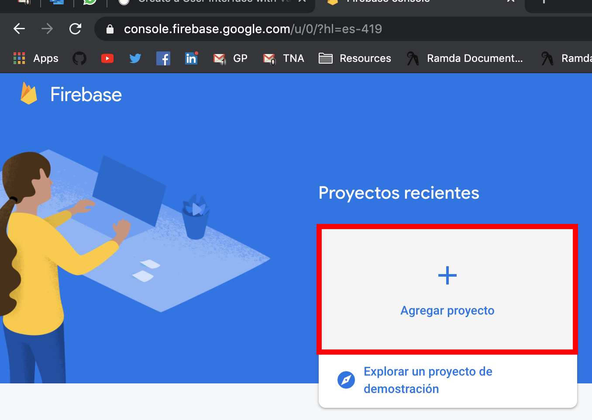

Vamos a clickear en "Nuevo proyecto" y completamos los datos necesarios.

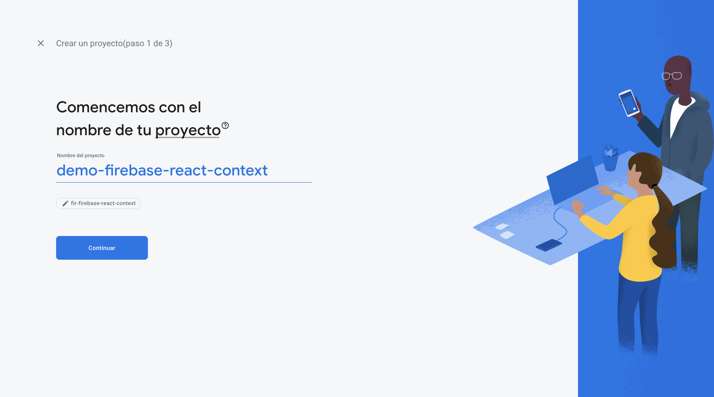

Una vez creado clickeamos en "Authentication" en el panel izquierdo.

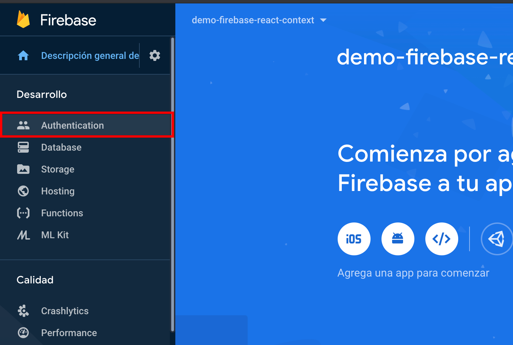

Luego en "Configura el método de acceso"

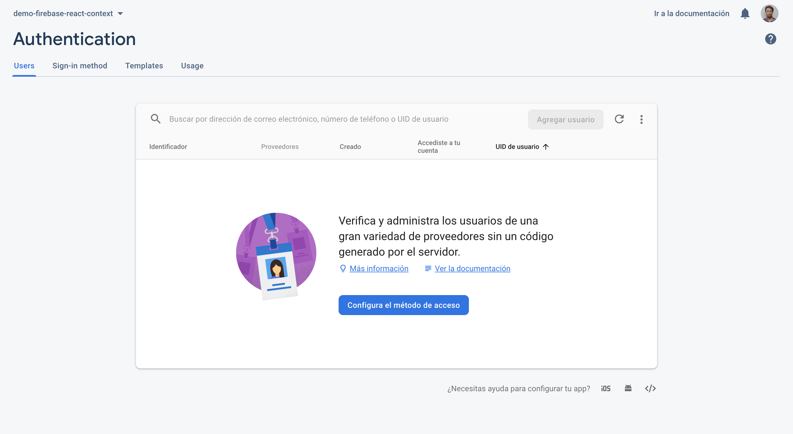

En este caso vamos a usar Google, lo seleccionamos, llenamos los campos y clickeamos "Guardar"

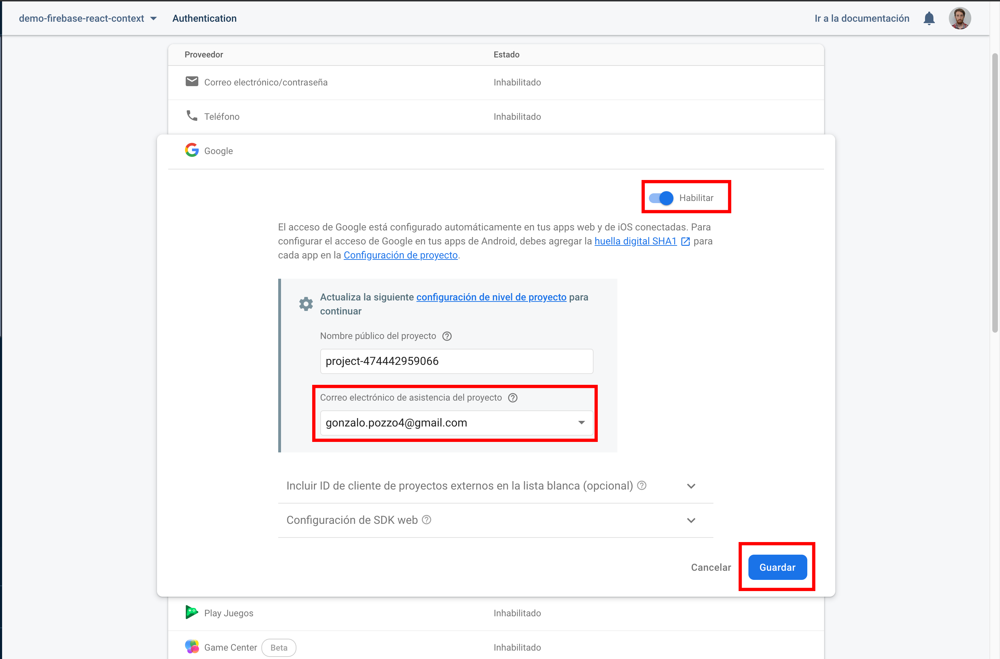

Ahora volvemos al inicio del proyecto y clickeamos sobre el botón de "Web" para crear nuestra aplicación

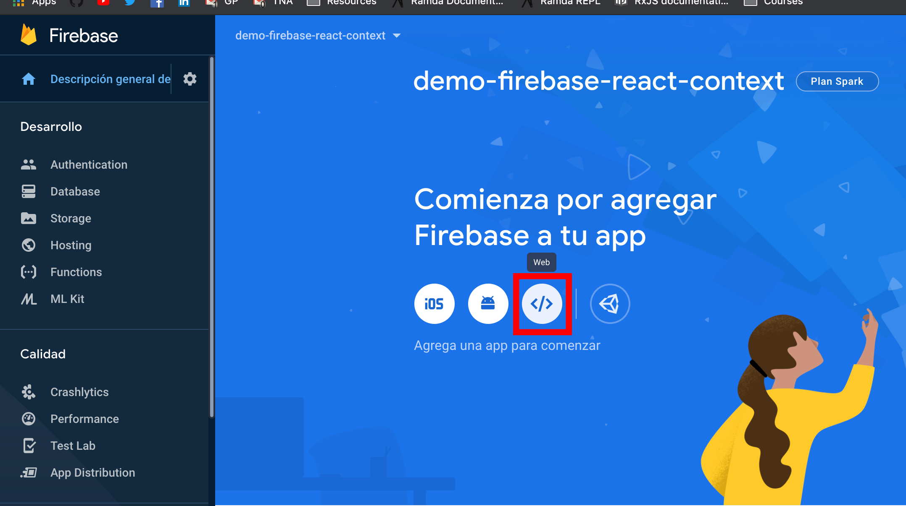

> Antes creamos el proyecto y ahora la aplicación, son entidades diferentes ya que un proyecto puede tener varias aplicaciones con configuraciones diferentes

Le damos un nombre a nuestra aplicación y clickeamos en "Registrar app"

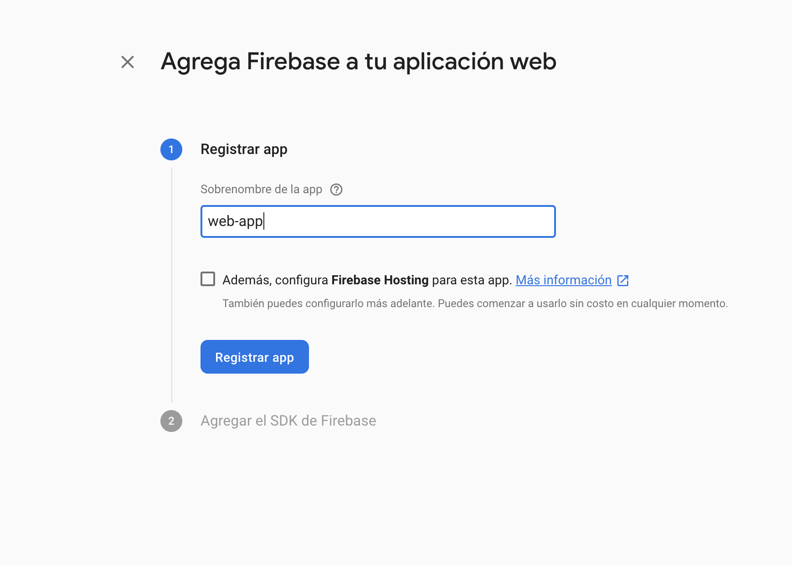

Nos vamos a copiar el contenido de la variable `firebaseConfig` para dentro de un rato

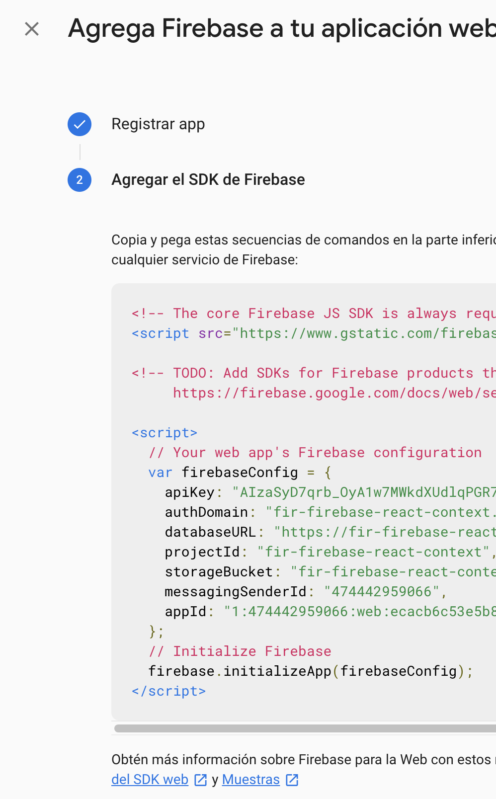

## Creando nuestra aplicación React
Vamos a usar [Create React App](https://create-react-app.dev/) para crear una aplicación muy simple. Para eso nos vamos a ir a la terminal, nos vamos a parar en nuestra carpeta de proyectos (o donde quieras crear el proyecto) y vamos a ejecutar:

```bash
npx create-react-app firebase-context-demo
```

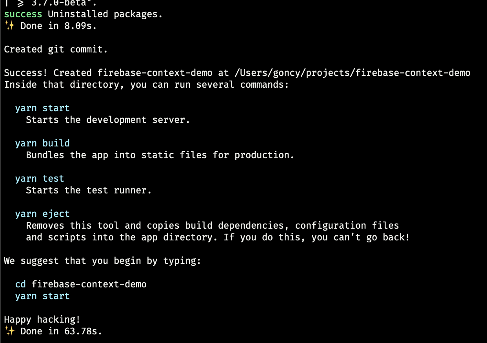

## Configurando nuestra aplicación
Una vez que termine vamos a entrar en la carpeta ejecutando:
```bash
cd firebase-context-demo
```

Y vamos a agregar Firebase a nuestro proyecto ejecutando:

```bash
npm install firebase
```

Ahora vamos a crear un archivo `.env` en la raíz de nuestro proyecto y vamos a pegar la configuración de Firebase que sacamos de la variable `firebaseConfig` más arriba, convirtiendo todas las variables a mayúsculas, con guiones bajos, el prefijo REACT_APP y asegurandose de que no queden comas al final de cada línea.

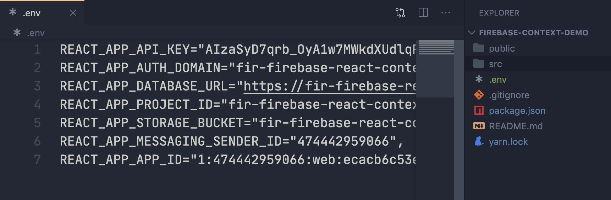

> Los archivos .env (environment / ambiente) guardan información sensible de nuestra aplicación como claves, no se suben al repositorio publico y pueden ser accedidas desde la app bajo el prefijo `process.env` por ejemplo: usando `process.env.REACT_APP_API_KEY` en nuestro `firebase.js` mas adelante nos va a permitir acceder a nuestra api key de Firebase sin exponerla al público.

Ahora vamos a correr nuestra aplicación ejecutando:
```bash
npm start
```

Una vez que termine se nos va a abrir un navegador con una aplicación parecida a esta:

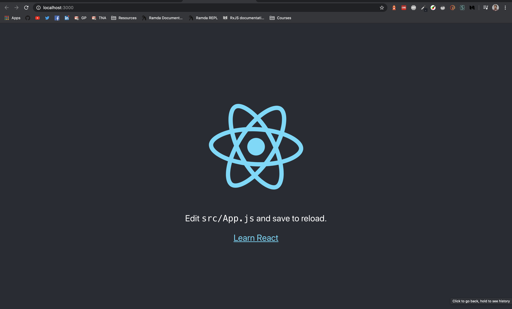

Listo, ya estamos listos para ponernos a codear!

## Integrando Firebase Authentication
Vamos a crear un archivo `firebase.js` dentro de `src` con el siguiente contenido:

```js
import firebase from "firebase/app";

import "firebase/auth";

firebase.initializeApp({
  apiKey: process.env.REACT_APP_API_KEY,
  authDomain: process.env.REACT_APP_AUTH_DOMAIN,
  databaseURL: process.env.REACT_APP_DATABASE_URL,
  projectId: process.env.REACT_APP_PROJECT_ID,
  storageBucket: process.env.REACT_APP_STORAGE_BUCKET,
  messagingSenderId: process.env.REACT_APP_MESSAGING_SENDER_ID,
  appId: process.env.REACT_APP_APP_ID,
});

const auth = firebase.auth();
const providers = {
  google: new firebase.auth.GoogleAuthProvider(),
};

export { auth, providers };
export default firebase;
```

De esta manera inicializamos Firebase y exportamos las variables que vamos a necesitar en nuestra aplicación.

Vamos a crear una carpeta `session` dentro de `src` donde vamos a manejar todo lo referido a la sesión del usuario. Dentro de esa carpeta vamos a crear los archivos `context.js`, `api.js`, `screens/Login.js` y `hooks.js`.

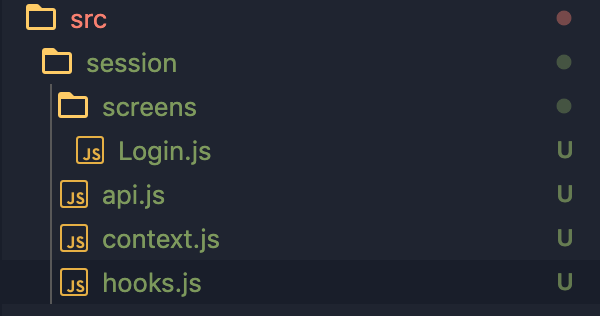

A nuestro `api.js` le vamos a dar el siguiente contenido:
```js
import { auth, providers } from "../firebase";

export default {
  signIn: () => auth.signInWithPopup(providers.google),
  signOut: () => auth.signOut(),
  onChange: (callback) => auth.onAuthStateChanged(callback),
};
```

Vamos a tener un metodo para iniciar sesión, uno para cerrar sesión y un para escuchar cada vez que haya un cambio en la sesión.

En tanto a `context.js` le vamos a dar el siguiente contenido:
```jsx
import React from "react";

import auth from "./api";
import Login from "./screens/Login";

const SessionContext = React.createContext(null);

const SessionProvider = ({ children }) => {
  const [user, setUser] = React.useState(null);
  const [status, setStatus] = React.useState("init");

  React.useEffect(() => {
    auth.onChange(user => {
      setUser(user);

      setStatus("restored");
    });
  }, []);

  if (!user) return <Login signIn={auth.signIn} status={status} />;

  const state = { user };
  const actions = { signOut: auth.signOut, signIn: auth.signIn };

  return <SessionContext.Provider value={{ state, actions }}>{children}</SessionContext.Provider>;
};

export { SessionProvider as Provider, SessionContext as default };
```

Vamos a crear un componente que no solo, usando context, va a proveer de la información de sesión a toda la aplicación, sino que escuchamos dentro del `useEffect` todos los cambios de sesión que haya en Firebase para asegurarnos de que siempre tengamos la sesión actualizada.
Para bloquear el renderizado vamos a retornar nuestro componente de `screens/Login.js` en caso de no haber una sesión activa.

A nuestro `screens/Login.js` le vamos a dar el siguiente contenido:
```jsx
import React from "react";

const LoginScreen = ({ signIn, status }) => (
  <div>
    {status === "init" && <span>Intentando de restaurar sesión...</span>}
    {status === "restored" && <button onClick={signIn}>Iniciar sesión con Google</button>}
  </div>
);

export default LoginScreen;
```
El componente va a recibir una prop `signIn` que se va a ejecutar cuando se clickee en "Iniciar sesión con Google" y va a mostrar diferentes mensajes dependiendo del valor de la prop `status`.

Por último vamos a darle el siguiente contenido a `hooks.js`:

```js
import React from "react";

import SessionContext from "./context";

export function useUser() {
  const {
    state: { user },
  } = React.useContext(SessionContext);

  return user;
}
```

En este caso usamos nuestro `SessionContext` pasandoselo al hook de `useContext` que nos provee React, de el, extraemos el `user` que exponemos en nuestro `state` y lo retornamos. Este hook nos va a permitir acceder a la información de sesión de una manera muy simple desde nuestros componentes.

> Nuestro SessionProvider expone dos valores, `state` que contiene al usuario y `actions` que son funciónes que interactuan con la sesión (iniciar / cerrar sesión)

Nos vamos a dirigir a nuestro `index.js` y vamos a envolver nuestro componente `App` con nuestro `SessionProvider`:

```jsx
import React from 'react';
import ReactDOM from 'react-dom';

import {Provider as SessionProvider} from "./session/context"
import App from './App';

import * as serviceWorker from './serviceWorker';

import './index.css';

ReactDOM.render(
  <React.StrictMode>
    <SessionProvider>
      <App />
    </SessionProvider>
  </React.StrictMode>,
  document.getElementById('root')
);

// If you want your app to work offline and load faster, you can change
// unregister() to register() below. Note this comes with some pitfalls.
// Learn more about service workers: https://bit.ly/CRA-PWA
serviceWorker.unregister();
```

Ahora vamos a `App.js` para mostrar la información de sesión:

```jsx
import React from 'react';

import {useUser} from "./session/hooks"

import logo from './logo.svg';

import './App.css';

function App() {
  const user = useUser();

  return (
    <div className="App">
      <header className="App-header">
        
        <p>
          Edit <code>src/App.js</code> and save to reload.
        </p>
        <a
          className="App-link"
          href="https://reactjs.org"
          target="_blank"
          rel="noopener noreferrer"
        >
          Bienvenido: {user.displayName} - {user.email}
        </a>
      </header>
    </div>
  );
}

export default App;
```

Si volvemos al navegador vamos a ver lo siguiente:

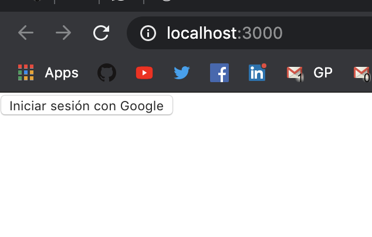

Si clickeamos el botón nos va a llevar a la ventana de inicio de sesión de Google:

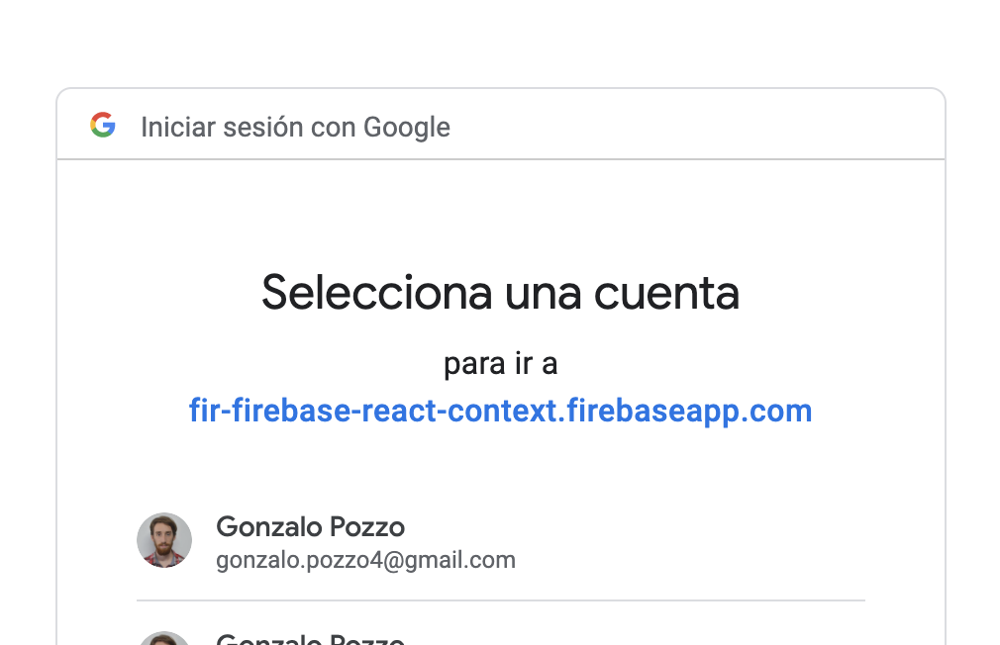

Y luego a nuestra aplicación!

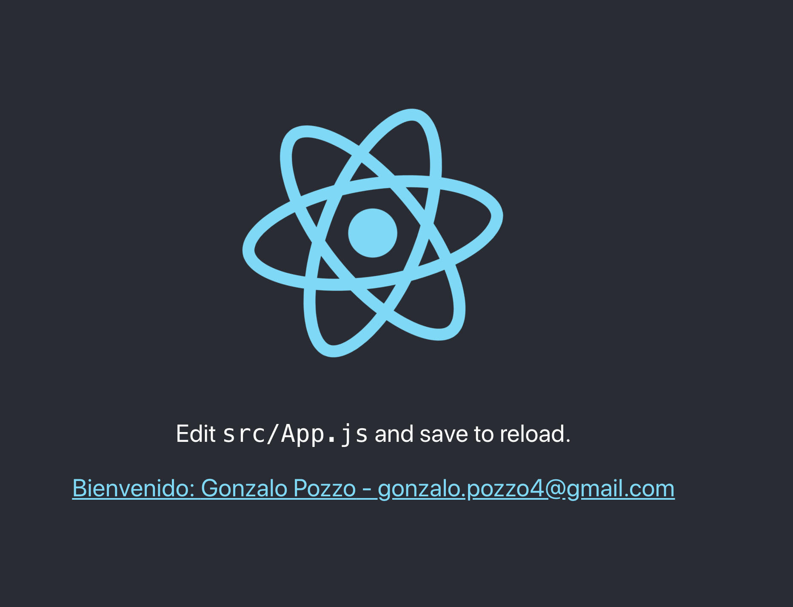

Si recargamos la página vamos a ver el mensaje "Intentando de restaurar sesión..." unos segundos y luego nuestra aplicación, no solo ya tenemos nuestra lógica de autenticación lista sino que también la de hidratación de sesión!

## Código
Si querés ver el código del proyecto terminado o repasar algo, podés encontrarlo [acá](https://github.com/goncy/blog/tree/master/src/content/autenticacion-con-firebase-en-react/repository) o en [este codesandbox](https://codesandbox.io/s/github/goncy/blog/tree/master/src/content/autenticacion-con-firebase-en-react/repository).

> Antes de correrlo renombrá el archivo `.env.template` a `.env` e ingresá tus credenciales de Firebase

## Felicitaciones
Pero esto no termina acá, la autenticación puede ser también via mail, otros proveedores y más. Firebase tambien tiene servicios de bases de datos como Firestore, muy fáciles de usar (mucho mas fácil todavía si ya tenemos Firebase configurado en nuestra aplicación como ahora).

Si querés saber como darle a cada usuario autenticado una base de datos en tiempo real a la cual solo el va a tener acceso, podés ver [este post](/base-de-datos-tiempo-real-firebase-firestore-react-context).
