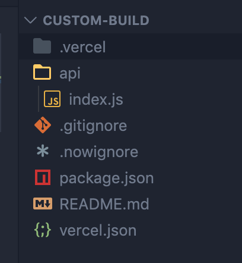
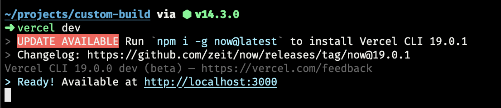
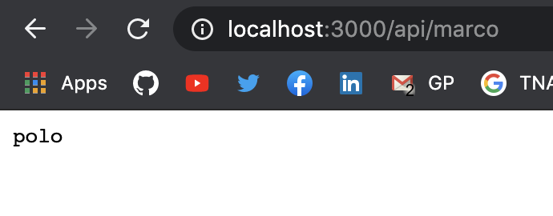

Perdí todo un día intentando de hacer esto así que me pareció prudente volcarlo en un post para que a menos gente le pase.

> Este post lo escribí en 2017, el código es viejo pero debería seguir siendo relevante

## Qué vamos a necesitar?
* Una [cuenta en Vercel](https://vercel.com/signup)
* La [CLI de Vercel](https://vercel.com/download)

## Creando nuestro proyecto
Vamos a ir a la terminal y estando parados en la carpeta donde queramos crear nuestro proyecto corremos:
```bash
vercel init
```


Elegimos `custom-build` y luego siguiente a todo el resto.

## Creando nuestra aplicación
En la terminal, parados en la carpeta de nuestro proyecto vamos a instalar express:

```bash
yarn add express

# O si usas NPM
npm install express --save
```

Creamos un archivo `vercel.json` en el root de nuestro proyecto y un archivo `index.js` dentro de una carpeta `api`, así:



En nuestro `vercel.json` vamos a poner lo siguiente:

```json
{
  "functions": {
    "api/index.js": {
      "runtime": "@now/node@1.6.1"
    }
  },
  "rewrites": [{
    "source": "/api/(.*)", "destination": "/api/index.js"
  }]
}
```

Y en nuestro `api/index.js` lo siguiente:

```js
const express = require('express');

const app = express();

app.get('/api', function (req, res) {
  return res.json({hello: 'dog'});
});

app.get('/api/marco', function (req, res) {
  return res.end("polo");
});

app.listen(3000, () => console.log("Running on port 3000!"));
```

### Que hicimos?
En nuestro `vercel.json` le indicamos que nuestro `api/index.js` es una app `node` y que cualquier ruta llamada a `/api` debe ser resuelta por nuestro `api/index.js`

Y en nuestro `api/index.js` levantamos un server de express con 2 rutas, `/api` que nos va a devolver un JSON con `{"hello": "dog"}` y `/api/marco` que nos va a devolver `polo`.

Muy bien, vamos a la terminal devuelta y corremos `vercel dev`.



Ahora nos dirigimos a `http://localhost:3000/api/marco`



Bien! Ya tenemos nuestra aplicación andando.

## Deployando a Vercel
En la terminal, terminamos el proceso de `vercel dev` usando ctrl + c y ejecutamos `vercel`


Listo 💪
