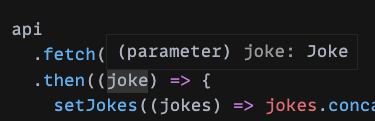
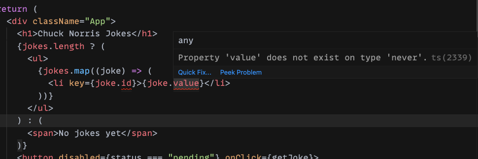

Recuerdo que cuando quise empezar a usar TypeScript, todos los recursos que encontraba eran super crípticos, con tipos e interfaces super complejos y terminaba cerrando todo por que me mareaba mas de lo que me ayudaba. Si ese es tu caso, en este post vamos a ver como migrar una aplicación muy simple, que se trae chistes de Chuck Norris de una [api](https://api.chucknorris.io/), de JavaScript a TypeScript, usando [create-react-app](https://create-react-app.dev/) en [CodeSandbox](https://codesandbox.io/).

## Explicame que es TypeScript como si fuera junior
Es un lenguaje, tipado (nos permite definir tipos de datos a las cosas), que compila a JavaScript.

## Proyecto inicial
Vamos a ir a [este link](https://codesandbox.io/s/migrate-to-typescript-initial-ie920?file=/src/App.tsx), donde vamos a encontrar nuestra aplicación base, creada con el [template de TypeScript](https://create-react-app.dev/docs/adding-typescript/#getting-started-with-typescript-and-react).

<iframe src="https://codesandbox.io/embed/migrate-to-typescript-initial-ie920?fontsize=14&hidenavigation=1&theme=dark&view=preview"
     style="width:100%; height:500px; border:0; border-radius: 4px; overflow:hidden;"
     title="Migrate to typescript - initial"
     allow="accelerometer; ambient-light-sensor; camera; encrypted-media; geolocation; gyroscope; hid; microphone; midi; payment; usb; vr; xr-spatial-tracking"
     sandbox="allow-forms allow-modals allow-popups allow-presentation allow-same-origin allow-scripts"
   ></iframe>

> Para para para, no ibamos a aprender a migrar de JavaScript a TypeScript?

Bueno, si. Si entran al link van a ver dos cosas. La primera es como crear un proyecto de create-react-app con TypeScript y la otra es como agregar TypeScript a un proyecto de create-react-app.

Generalmente agregar TypeScript a tu proyecto va a depende de que stack o tool estes usando (NextJS, create-react-app, config custom), pero hoy en día hay bastante información sobre como hacerlo, hoy nos vamos a centrar en create-react-app.

> Para para para, en el proyecto inicial, todos los archivos son .ts o .tsx...

Si, para poder usar TypeScript en nuestro proyecto, los archivos `.js` se deben renombrar a `.ts` o `.tsx`, dependiendo si incluyen código `JSX` o no. Al usar el template de TypeScript de create-react-app, los archivos creados por defecto tienen la extensión necesaria.

Pero atentis! Si bien los archivos creados tienen extensión de TypeScript, podemos ver que el código no tiene ningún tipo definido. Es más, podriamos crear un proyecto con create-react-app sin TypeScript, copiar este código y funcionaría igual.

* Q - Podémos escribir JavaScript plano en una aplicación TypeScript sin ningún tipo e ir agregandolos de a poco?
* A - Si.

Un pequeño disclaimer con esto es que depende como configuremos TypeScript (el archivo `tsconfig.json`), si no definimos tipos a todo, nuestra aplicación _no compila_. Obviamente no es el caso para nuestro ejemplo y tampoco vamos a cubrir como configurar el `tsconfig.json`, ya que no me se todas las propiedades y cuando necesito algo solo lo Googleo 🤷‍♂️.

## Agarremos la pala
Empecemos definiendo que cosas de TypeScript vamos a usar y que són.

### Interfaces
Es una estructura que propiedades y sus tipos de datos, estas propiedades pueden ser desde primitivos, como numeros o texto, hasta funciones, otras interfaces y tipos mas complejos. Por ejemplo:

```ts
interface Joke {
  id: string;
  value: string;
}
```
> Vamos a mantener los ejemplos simples para que sea fácil, siempre podés investigar más cuando lo necesites.

### Enums
Nos permite declarar una serie de constantes o variantes. Por ejemplo:

```ts
enum Status {
  Init = "init",
  Pending = "pending",
  Resolved = "resolved",
  Rejected = "rejected",
}
```
> No te preocupes si todavía no tiene sentido, vamos a verlo aplicado en nuestra aplicación más adelante.

## Tipando nuestra aplicación
Vamos a necesitar crear dos tipos solamente para nuestra aplicación.

Sorpresa! Son los tipos que ya creamos arriba.

Vamos a crear un archivo `types.ts` dentro de la carpeta `src` con el siguiente contenido:

```ts
export enum Status {
  Init = "init",
  Pending = "pending",
  Resolved = "resolved",
  Rejected = "rejected"
}

export interface Joke {
  id: string;
  value: string;
}
```
> Notese el `export` adelante, que nos permite exportar para importar en los archivos que necesitemos.

### api.ts
Vamos a empezar por `api.ts`, que actualmente se ve así:
```ts
export default {
  fetch: () =>
    fetch(`https://api.chucknorris.io/jokes/random`).then((res) => res.json())
};
```

Vamos a importar nuestro tipo `Joke` haciendo:
```ts
import { Joke } from "./types";
```

Y vamos a agarrar nuestra función `fetch` y decirle que su valor de retorno va a ser una `Promise` que resuleve a un objeto de tipo `Joke`:

```ts
import { Joke } from "./types";

export default {
  fetch: (): Promise<Joke> =>
    fetch(`https://api.chucknorris.io/jokes/random`).then((res) => res.json())
};
```
> El valor de retorno se define antes del cuerpo de la función, después de los parentesis que contiene a los parametros.

De esta manera TypeScript ya sabe que tipo de dato va a devolver nuestra función, si vamos a nuestro `App.tsx` y hacemos hover sobre el parametro `joke` de linea 16, vamos a ver que TypeScript ya esta identificando el valor correcto.



### App.tsx
Ahora vamos a tipar nuestro `App.tsx`, podémos ver que el editor ya nos marca algunos errores:



Vamos a importar nuestros dos tipos en este archivo haciendo:
```ts
import { Joke, Status } from "./types"
```

Ahora vamos a decirle a nuestro `useState` de `jokes` que el tipo de dato que vamos a almacenar ahí va a ser un array de `Joke`.
```ts
const [jokes, setJokes] = React.useState<Joke[]>([]);
```

Magia! Todos los errores desaparecieron, no solo eso, si hacemos hover sobre la variable `joke` o `jokes` en cualquier parte, podemos ver que propiedades contiene y además tenemos autocomplete e intellisense cada vez que las queramos usar.

Si bien ya solucionamos todos los errores y conseguimos unas cuantas ventajas, vamos a tipar nuestro `status` para ver como usar un `enum`.
```ts
const [status, setStatus] = React.useState<Status>(Status.Init);
```

En este caso le decimos a `status` que es de tipo `Status`, por ende, solamente vamos a poder hacer un `setStatus` con alguna de las variantes disponibles en el enum `Status`, cualquier otro valor, aunque sea de tipo string, nos va a dar un error. No solo eso, aunque el valor del string que le queramos dar sea el mismo que el que esta definido en el enum, va a fallar igual. Vamos a actualizar nuestros llamados a `setStatus`.

```ts
function getJoke() {
    setStatus(Status.Pending);

    api
      .fetch()
      .then((joke) => {
        setJokes((jokes) => jokes.concat(joke));
        setStatus(Status.Resolved);
      })
      .catch(() => setStatus(Status.Rejected));
  }
```

Y también nuestro if para deshabilitar el botón:

```tsx
<button disabled={status === Status.Pending} onClick={getJoke}>
  Fetch joke
</button>
```

## Listo ✨
Felicitaciones, ya agregaste, usaste y aprendiste algunas cosas de TypeScript, en un tiempo ya no va a haber vuelta atrás y lo vas a amar.

Si querés podés ver el código de la aplicación migrada [acá](https://codesandbox.io/s/migrate-to-typescript-completed-tzqes?file=/src/App.tsx).

---

Si te gustan estos posts, no te olvides de seguirme en:
* [Twitter](https://twitter.com/goncy)
* [Twitch](https://twitch.tv/goncypozzo)
* Sumarte al [discord](https://discord.gg/rAmPWU6eHg)
