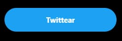
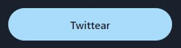
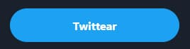

Me encontré varias veces creando una carpeta de componentes de UI para crear un componente `Button` que extendía el componente original pero le cambiaba el `borderRadius`, `fontWeight` o cosas similares. Muchas veces me pregunté si eso no debería pertenecer al theme, si no deberíamos poder modificar esas cosas sin tener que crear componentes nuevos.

Por suerte, navegando la [documentación de ChakraUI](https://chakra-ui.com/docs/theming/customize-theme) (la cual es muy buena), encontré que es posible.

> Si querés saber un poco más de que es ChakraUI, podés leer [este post](/acelerando-desarrollo-chakra).

## Creando nuestro propio theme
Vamos a crear un archivo `theme.ts` (o .js) dentro de nuestra carpeta `src`, en el que vamos a agregar el siguiente contenido:
```ts
import {extendTheme} from "@chakra-ui/react";

export default extendTheme({});
```

Esto nos va a crear un nuevo theme, extendiendo el theme por defecto de ChakraUI, por el momento, sin modificaciones.

## Usando nuestro theme
Para que efectivamente ChakraUI pueda usar nuestro theme, vamos a tener que envolver nuestra aplicación con el componente `ChakraProvider` y pasarle nuestro theme. Para eso vamos a ir al componente más externo de nuestra app (`index.tsx` o `main.tsx`) y vamos a envolver todo:
```tsx
import React from "react";
import ReactDOM from "react-dom";
import {ChakraProvider, ColorModeScript} from "@chakra-ui/react";

import App from "./app";
import theme from "./theme";

ReactDOM.render(
  <>
    <ColorModeScript initialColorMode={theme.config.initialColorMode} />
    <ChakraProvider theme={theme}>
      <App />
    </ChakraProvider>
  </>,
  document.getElementById("root"),
);
```
> También agregamos el `ColorModeScript` para poder agregar un `darkMode` a nuestra aplicación más adelante.

Con esto ya estamos listos para ponernos a agregar un par de componentes.

## Agregando un color primario
Es una buena práctica tener en nuestro theme colores con nombres mas descriptivos, para que si queremos cambiar todo el look and feel de nuestra aplicación el día de mañana, sea más fácil.
Para eso, vamos a nuestro `theme.ts` y vamos a crear un color `primary` basado en el color `twitter` que está incluido dentro del theme por defecto de ChakraUI.

```ts
import {extendTheme, theme} from "@chakra-ui/react";

export default extendTheme({
  colors: {
    primary: theme.colors.twitter,
  },
});
```

Vamos a ir a nuestro componente `App` y vamos a agregar un botón `Twittear` con un `colorScheme` siendo `primary` y un `size` de `lg`.

```tsx
<Button colorScheme="primary" size="lg">
  Twittear
</Button>
```


> Nuestro botón


> El de Twitter

Está mal, pero no tan mal diría Guido. Repasemos algunas cosas diferentes:
* `fontSize`
* `fontWeight`
* `borderRadius`

Y también vemos que tenemos el `dark mode` activado en Twitter.

## Modificando nuestros componentes desde el theme
Volvemos a nuestro `theme.ts` y lo dejamos así:

```ts
import {extendTheme, theme} from "@chakra-ui/react";
import {mode} from "@chakra-ui/theme-tools";

export default extendTheme({
  config: {
    initialColorMode: "dark",
    useSystemColorMode: false,
  },
  colors: {
    primary: theme.colors.twitter,
  },
  components: {
    Button: {
      baseStyle: {
        borderLeftRadius: 9999,
        borderRightRadius: 9999,
        fontWeight: "bold",
      },
      sizes: {
        lg: {
          paddingY: 3,
          fontSize: "md",
        },
      },
    },
  },
});
```

Que fue lo que hicimos? Seteamos el `initialColorMode` en `dark` para que nuestra aplicación se muestre en dark mode. También reemplazamos algunos estilos base de nuestro componente `Button` para darle unos border redondeados, letra más grande y espaciado vertical.



Vemos que efectivamente se cambió el `fontSize` y `fontWeight` y los bordes se redondearon. Pero el color de nuestro botón cambió 😢. También el texto del botón es negro en vez de blanco. Esto es por que ChakraUI internamente hace cambios en los colores al pasar al dark mode.

## Aplicando cambios basados en el color mode
Vamos a volver a nuestro `theme.ts` y lo vamos a dejar así:

```ts
import {extendTheme, theme} from "@chakra-ui/react";
import {mode} from "@chakra-ui/theme-tools";

export default extendTheme({
  config: {
    initialColorMode: "dark",
    useSystemColorMode: false,
  },
  colors: {
    primary: theme.colors.twitter,
  },
  components: {
    Button: {
      baseStyle: {
        borderLeftRadius: 9999,
        borderRightRadius: 9999,
        fontWeight: "bold",
      },
      sizes: {
        lg: {
          paddingY: 3,
          fontSize: "md",
        },
      },
      variants: {
        solid: (props) => ({
          backgroundColor: `${props.colorScheme}.500`,
          color: mode(undefined, "white")(props),
        }),
      },
    },
  },
});
```

Hacemos uso de la función utilitaria `mode` incluida en las `theme-tools` de ChakraUI, que nos permite definir diferentes valores para light mode (primer parámetro) y dark mode (sefundo parámetro). En caso de querer mantener la configuración actual para alguno de los casos, podemos pasar `undefined`.

En este caso estamos sobreescribiendo algunas propiedades de la variante `solid` (la variante por defecto de los botones). Cuando editamos una propiedad del theme podemos pasar un objeto, o también podemos pasar una función que recibe las `props` como parametro.

De esta manera podemos asegurarnos de usar la variante `500` del color que setiemos en el `colorScheme` y que el color del texto sea `white` cuando estemos en dark mode.



Bien 🙌, nuestro botón ya se ve mucho mejor. Sin embargo, si los cambios que hay que hacerle al theme son muchos, podemos considerar mover todos estos overrides a sus propios archivos como [lo indica la documentación de ChakraUI](https://chakra-ui.com/docs/theming/customize-theme).

## Bonus (generando types para nuestro theme)
Cuando queramos definir un `colorScheme` en nuestros componentes, vamos a ver que los disponibles van a ser los incluidos en el theme default de ChakraUI pero no vemos nuestro color personalizado `primary` 😢.

Para actualizar los tipos de nuestro theme podemos instalar la dependencia `@chakra-ui/cli`:
```bash
npm install @chakra-ui/cli -D
```

Y correr el comando `tokens`:
```bash
npx chakra-cli tokens ./src/theme.ts
```

Esto va a actualizar los tipos internos de ChakraUI basado en nuestro theme 🙌. Recordá que debes ejecutar este comando cada vez que hagas modificaciones a tu theme.

---

Si te gustan estos posts, no te olvides de seguirme en:
* [Twitter](https://twitter.com/goncy)
* [Twitch](https://twitch.tv/goncypozzo)
* Sumarte al [discord](https://discord.gg/rAmPWU6eHg)
