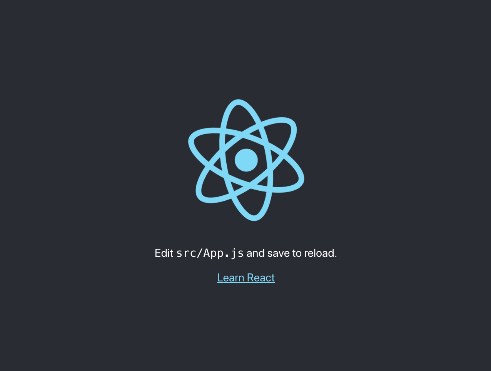

Cuando una app React / Redux va creciendo nos damos cuenta de que hay procesos que se vuelven muy repetitivos, como agregar nuestros reducers al root reducer.

La estructura de directorios es una de las cosas mas importantes para tener nuestra aplicación bien organizada, esto nos va a permitir encontrar los archivos fácilmente, no tener problemas a la hora de nombrarlos y poder estar seguro de que responsabilidad debe tener cada componente con respecto a su utilidad.

Por eso hoy nos vamos a centrar en estos dos puntos.

Para esto vamos a crear una aplicación muy simple que va a obtener un chiste desde [esta API](https://api.chucknorris.io/random) cada vez que toquemos un botón y los va a listar, junto con un botón para eliminar cada chiste individualmente.

## Creando nuestra aplicación

Lo primero que vamos a hacer es crear una nueva aplicación usando [create-react-app](https://github.com/facebook/create-react-app)

```bash
npx create-react-app reducing-boilerplate
```

Vamos a iniciar nuestra aplicación para asegurarnos de que todo anda correctamente.

Nos situamos en la carpeta reducing-boilerplate que creó create-react-app y ejecutamos:

```bash
npm start
```

Se va a abrir una nueva pestaña en el navegador y vamos a ver la siguiente pantalla:



## Creando nuestro primer módulo

Podemos pensar un módulo como una agrupación de funcionalidad, cuando podemos asegurarnos que todo lo que este contenido en el pertenece a lo que su nombre indica.

Vamos a tener, reducers, api helpers y componentes que tengan que ver con chistes, parece que es una buena oportunidad para crear un módulo

### modules

Vamos a crear una carpeta modules en src. Dentro vamos a crear una carpeta joke
>  Los módulos se nombran en singular ya que refiere a la funcionalidad independientemente de la cantidad

Dentro de joke vamos a crear los archivos api.js, reducers.js y una carpeta components con un archivo JokesManager.js

Nuestra carpeta modules quedará así:

    .
    └── modules/
        └── joke/
           ├── api.js
           ├── reducers.js
           └── components/
              └── JokesManager.js

Por ahora nuestros archivos van a quedar vacíos pero ya vamos a ir a eso más adelante.

## Instalando y configurando Redux

Vamos a instalar las dependencias necesarias:

```bash
npm install redux react-redux
```

Creamos una carpeta db dentro de src, con los archivos reducers.js (nuestro root reducer), store.js (la configuración de redux), utils.js (una utilidad que vamos a ver en un rato).

    .
    └── db/
       ├── store.js
       ├── reducers.js
       └── utils.js

### /db/utils.js

requireAll se encarga de extraer la información que necesitamos de lo que nos devuelve [require.context](https://webpack.js.org/guides/dependency-management/)

```js
export const requireAll = ctx =>
  ctx
    .keys()
    .map(ctx)
    .map(m => m.default)
    .filter(Boolean);
```
>  No tiene sentido analizarlo mucho ya que es casi un copy-paste de la documentación de webpack

### db/reducers.js

Esto va a recorrer la carpeta modules y todos sus subdirectorios, buscando archivos llamados reducers.js y los va a combinar en un objeto. Esto significa que cada vez que creemos un modulo y agreguemos un nuevo archivo reducers.js no vamos a tener que agregarlo manualmente a nuestro root reducer!

```js
import {requireAll} from "./utils";

export default Object.assign(
  {},
  ...requireAll(require.context("../modules", true, /reducers\.js$/))
);
```
>  Si quisieramos agregar otro reducer manualmente podríamos hacerlo agregando una nueva entrada al *Object.assign*

### db/store.js

Creamos un store de redux usando nuestro root reducer

```js
import {createStore, combineReducers} from "redux";

import reducers from "./reducers";

export default createStore(combineReducers(reducers));
```

### index.js

Vamos a envolver toda nuestra app con el Provider de react-redux pasando por props el store que acabamos de crear:

```jsx
import React from "react";
import ReactDOM from "react-dom";
import {Provider} from "react-redux";

import App from "./App";

import store from "./db/store";

import "./index.css";

ReactDOM.render(
  <Provider store={store}>
    <App />
  </Provider>,
  document.getElementById("root")
);
```

## Implementando nuestro módulo

Vamos a agregar contenido a los archivos que creamos previamente en nuestro módulo.

### modules/joke/api.js

Se va a encargar de obtener la información de la API y transformarla en algo que nos sirva para usar desde nuestro componente.

```js
const URL = "https://api.chucknorris.io/jokes";

export default {
  random: {
    fetch: () =>
      fetch(`${URL}/random`)
        .then(res => res.json())
        .then(joke => joke.value)
  }
};
```
>  Usamos *fetch* nativo del browser y [promises](https://developer.mozilla.org/es/docs/Web/JavaScript/Referencia/Objetos_globales/Promise) por simplicidad, pero podés usar [async/await](https://developer.mozilla.org/es/docs/Web/JavaScript/Referencia/Sentencias/funcion_asincrona) o lo que prefieras.

### /modules/joke/reducers.js

Nuestra aplicación puede:
* Iniciar un pedido a la API, lo cual va a deshabilitar el botón de obtener chiste.
* Agregar un nuevo chiste a la lista, lo cual va a rehabilitar el botón de obtener chiste.
* Borrar un chiste de la lista.

```js
const initialState = {
  joke: {
    status: "init",
    list: []
  }
};

export default {
  joke: (state = initialState.joke, action) => {
    switch (action.type) {
      case "FETCH_JOKE": {
        return {
          ...state,
          status: "pending"
        };
      }

      case "ADD_JOKE": {
        return {
          ...state,
          list: state.list.concat(action.payload),
          status: "init"
        };
      }

      case "DELETE_JOKE": {
        return {
          ...state,
          list: state.list.filter(joke => joke !== action.payload)
        };
      }

      default:
        return state;
    }
  }
};
```

Para agregar mas reducers al mismo módulo podemos agregar mas elementos al objeto que exportamos:

```js
export default {
  joke: (state, action) => ...,
  selectedJoke: (state, action) => ...
}
```
>  Si no te gusta tener varios reducers en un mismo archivo podes crearlos dentro de una carpeta reducers e importarlos en reducer.js

### modules/joke/components/JokesManager.js

Nuestro componente va a:
* Mostrar una lista de chistes
* Tener un botón para borrar cada chiste
* Tener un botón para obtener un nuevo chiste

```jsx
import React from "react";
import {connect} from "react-redux";

import jokeApi from "../api";

const JokesManager = ({jokes, loading, getJoke, deleteJoke}) => (
  <div>
    <ul>
      {jokes.map(joke => (
        <li key={joke}>
          {joke}
          <button type="button" onClick={() => deleteJoke(joke)}>
            Delete
          </button>
        </li>
      ))}
    </ul>
    <button type="button" onClick={getJoke} disabled={loading}>
      Get joke
    </button>
  </div>
);

export default connect(
  ({joke}) => ({
    jokes: joke.list,
    loading: joke.status === "pending"
  }),
  dispatch => ({
    getJoke: () => {
      dispatch({type: "FETCH_JOKE"});

    return jokeApi.random
      .fetch()
      .then(joke => dispatch({type: "ADD_JOKE", payload: joke}));
    },
    deleteJoke: joke => dispatch({type: "DELETE_JOKE", payload: joke}),
  })
)(JokesManager);
```

## Usando nuestro módulo

Vamos a usar el JokesManager en nuestra app.

### App.js

```jsx
import React from "react";

import JokesManager from "./modules/joke/components/JokesManager";

const App = () => (
  <div>
    <h1>Chistes de Chuck Norris</h1>
    <JokesManager />
  </div>
);

export default App;
```

Y el resultado final:


## Recursos
* [Repositorio](https://github.com/goncy/reducing-redux-boilerplate)
* [Demo](https://goncy-reducing-redux-boilerplate.netlify.com/)

## Outro
* Creamos nuestra app con create-react-app.
* Creamos un módulo y los archivos que necesitabamos.
* Agregamos y configuramos Redux con ayuda de require.context
* Usamos nuestro módulo en la app.
